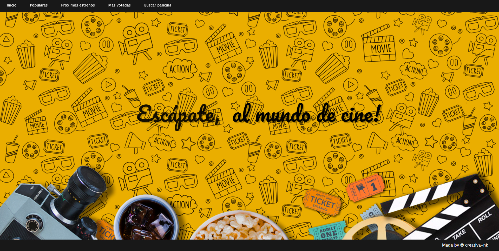
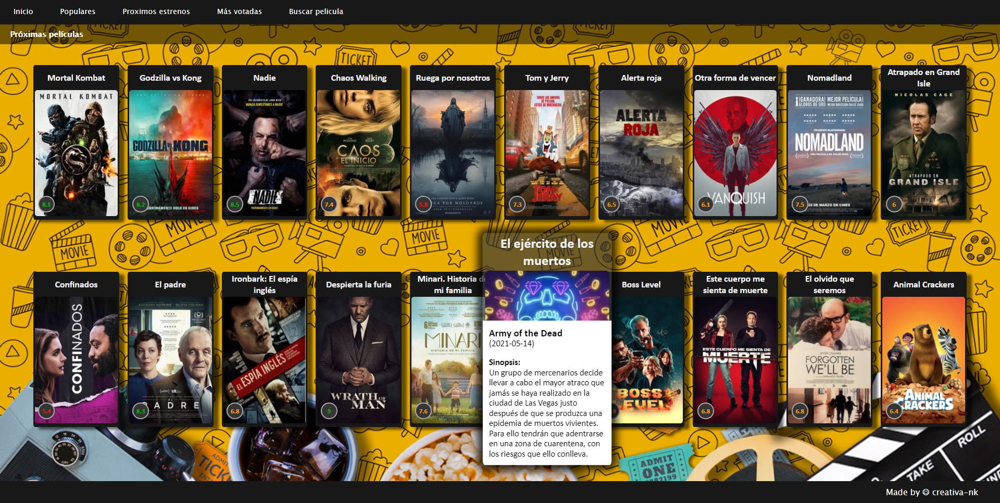
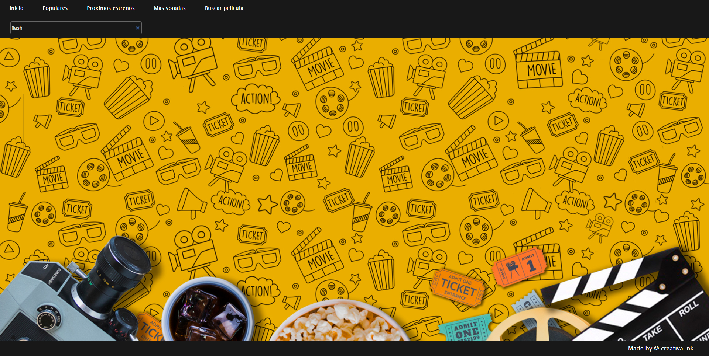
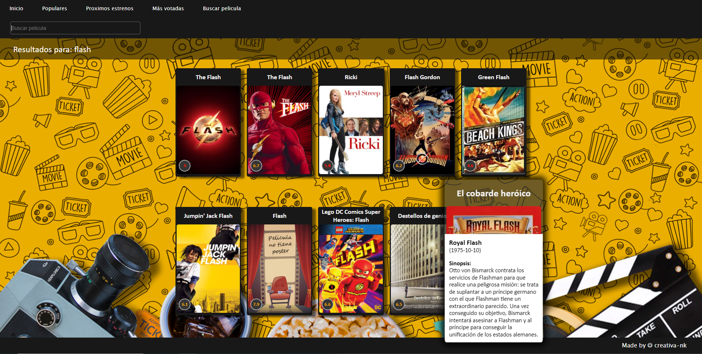

  
# React Movie App
The purpose of React Movie App is able to interact with API endpoints by Themoviedb.

The project has been created whith React, ReactHooks, JavaScript and Sass. 

## Getting started
-------------------

## Installacion

Use NPM in order to install everything the app needs to run correctly.

### `npm install`

## Running Project

In the project directory, you can run:

### `npm start`

Runs the app in the development mode.
Open [http://localhost:3000](http://localhost:3000) to view it in the browser.

## Description
---------------
Movies list pages with movie details 

Search and search results with movie details

## Future Improvements
- more movie details
- movil APP version
